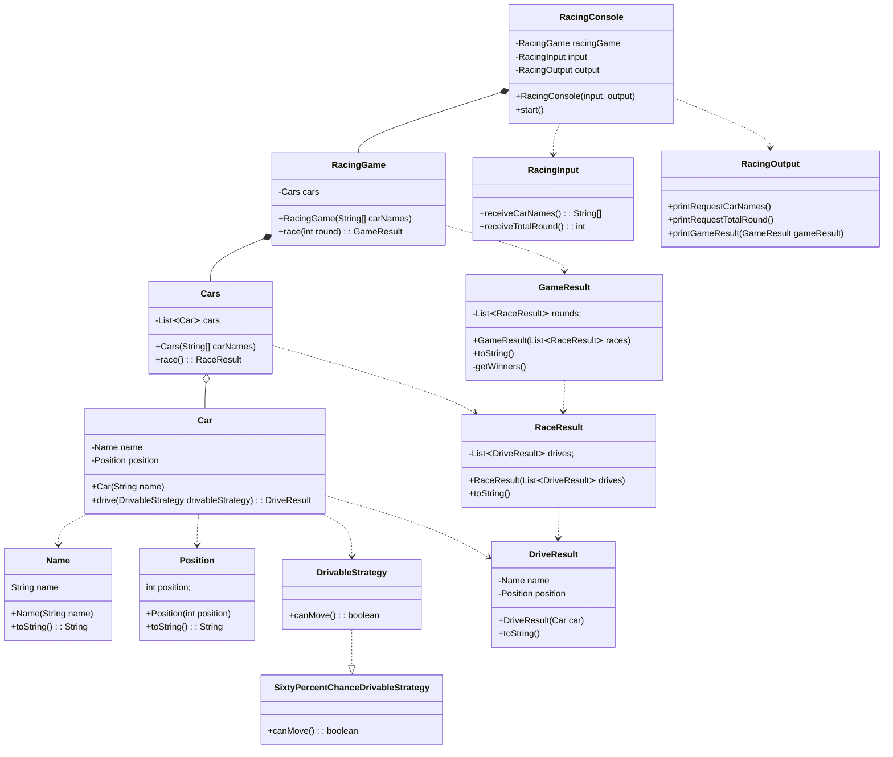

## 클래스 다이어그램

```mermaid
classDiagram
    class RacingConsole {
        -RacingGame racingGame
        -RacingInput input
        -RacingOutput output
        
        +RacingConsole(input, output)
        +start()
    }

    RacingConsole *-- RacingGame

    class RacingGame {
        -Cars cars

        +RacingGame(String[] carNames)
        +race(int round): GameResult
    }

    RacingGame *-- Cars

    class Cars {
        -List≺Car≻ cars

        +Cars(String[] carNames)
        +race(): RaceResult
    }

    Cars o-- Car

    class Car {
        -Name name
        -Position position

        +Car(String name)
        +drive(DrivableStrategy drivableStrategy) : DriveResult
    }
    
    Car ..> Name
    class Name {
        String name
        
        +Name(String name)
        +toString(): String
    }

    Car ..> Position

    class Position {
        int position;

        +Position(int position)
        +toString(): String
    }

    Car ..> DrivableStrategy

    class DrivableStrategy {
        +canMove(): boolean
    }

    DrivableStrategy ..|> SixtyPercentChanceDrivableStrategy

    class SixtyPercentChanceDrivableStrategy {
        +canMove(): boolean
    }

    RacingGame ..> GameResult

    class GameResult {
        -List≺RaceResult≻ rounds;

        +GameResult(List≺RaceResult≻ races)
        +toString()
        -getWinners()
    }

    GameResult ..> RaceResult
    Cars ..> RaceResult

    class RaceResult {
        -List≺DriveResult≻ drives;

        +RaceResult(List≺DriveResult≻ drives)
        +toString()
    }

    Car ..> DriveResult
    RaceResult ..> DriveResult

    class DriveResult {
        -Name name
        -Position position
        
        +DriveResult(Car car)
        +toString()
    }

    RacingConsole ..> RacingInput

    class RacingInput {
        +receiveCarNames() : String[]
        +receiveTotalRound() : int
    }

    RacingConsole ..> RacingOutput

    class RacingOutput {
        +printRequestCarNames()
        +printRequestTotalRound()
        +printGameResult(GameResult gameResult)
    }
```

## 기능 요구사항

- [ ] 60% 확률로 Car를 전진시키고 결과를 반환한다
- [ ] Cars의 모든 Car를 전진시켜 한 라운드를 진행하고 결과를 반환한다
- [ ] n번의 라운드를 진행해 한 게임을 진행하고 결과를 반환한다
- [ ] 사용자의 입력을 받아 게임을 진행시키고 게임 결과를 출력한다