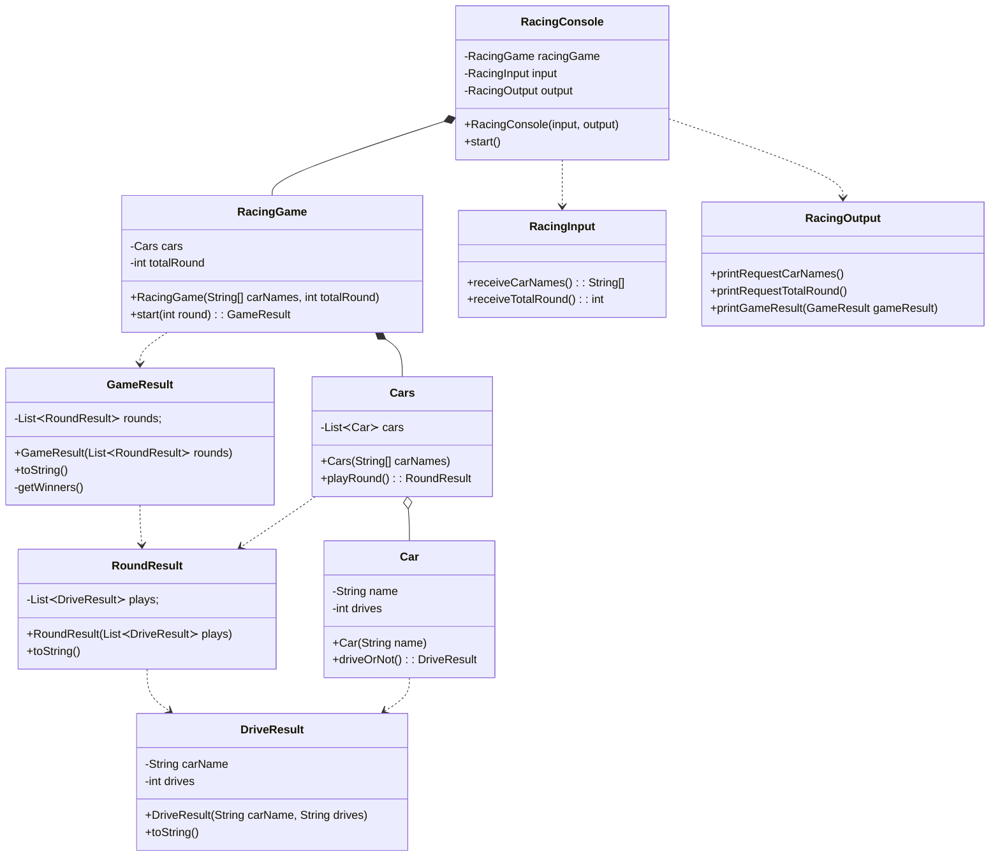

## 클래스 다이어그램

```mermaid
classDiagram
    class RacingConsole {
        -RacingGame racingGame
        -RacingInput input
        -RacingOutput output
        
        +RacingConsole(input, output)
        +start()
    }

    RacingConsole *-- RacingGame

    class RacingGame {
        -Cars cars
        -int totalRound

        +RacingGame(String[] carNames, int totalRound)
        +start(int round): GameResult
    }

    RacingGame *-- Cars

    class Cars {
        -List≺Car≻ cars

        +Cars(String[] carNames)
        +playRound(): RoundResult
    }

    Cars o-- Car

    class Car {
        -String name
        -int drives

        +Car(String name)
        +driveOrNot() : DriveResult
    }

    RacingGame ..> GameResult

    class GameResult {
        -List≺RoundResult≻ rounds;

        +GameResult(List≺RoundResult≻ rounds)
        +toString()
        -getWinners()
    }

    GameResult ..> RoundResult
    Cars ..> RoundResult

    class RoundResult {
        -List≺DriveResult≻ plays;

        +RoundResult(List≺DriveResult≻ plays)
        +toString()
    }

    RoundResult ..> DriveResult
    Car ..> DriveResult

    class DriveResult {
        -String carName
        -int drives
        
        +DriveResult(String carName, String drives)
        +toString()
    }

    RacingConsole ..> RacingInput

    class RacingInput {
        +receiveCarNames() : String[]
        +receiveTotalRound() : int
    }

    RacingConsole ..> RacingOutput

    class RacingOutput {
        +printRequestCarNames()
        +printRequestTotalRound()
        +printGameResult(GameResult gameResult)
    }
```

## 기능 요구사항

- [x] 60% 확률로 Car를 전진시키고 결과를 반환한다
- [x] Cars의 모든 Car를 전진시켜 한 라운드를 진행하고 결과를 반환한다
- [x] n번의 라운드를 진행해 한 게임을 진행하고 결과를 반환한다
- [x] 사용자의 입력을 받아 게임을 진행시키고 게임 결과를 출력한다